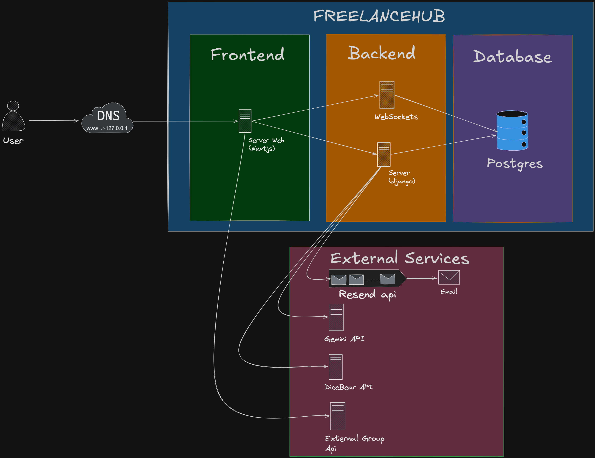
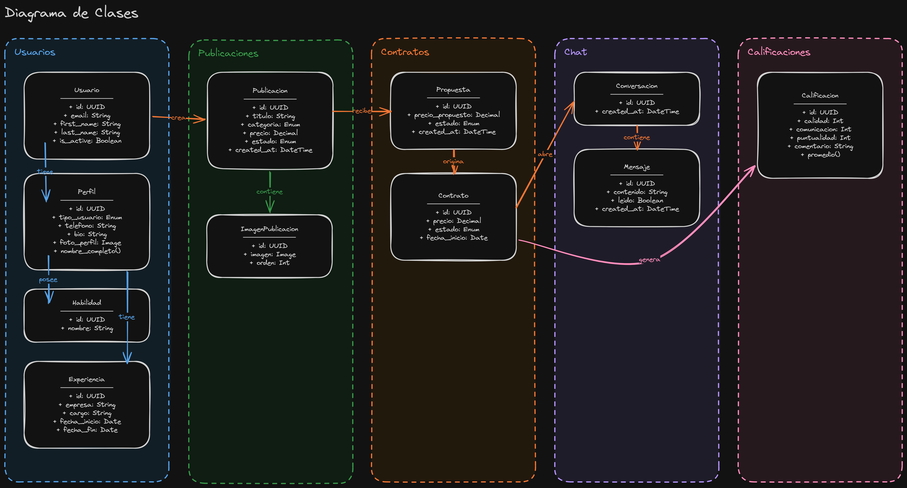

# Professional Services Marketplace

Plataforma web para el intercambio de servicios profesionales y freelance. Proyecto académico con enfoque en arquitectura de software, diseño limpio y buenas prácticas.

- **Backend:** Django 6 + Django REST Framework + PostgreSQL
- **Frontend:** Next.js 16 + TypeScript + Tailwind CSS + shadcn/ui
- **Auth:** JWT (SimpleJWT)
- **Infraestructura:** Docker Compose (3 servicios: db, backend, frontend)

## Integrantes

- **Andrés Vélez Rendón**
- **Tomás Ramírez**
- **Felipe Gómez**

---

## Arquitectura

El sistema sigue una arquitectura de tres capas con servicios externos para IA, email y avatares. Los usuarios acceden al frontend (Next.js) a través de un CDN/DNS, el backend (Django) gestiona la lógica de negocio y persiste en PostgreSQL. Aplicaciones externas (partners) consumen el feed público directamente del backend.



## Diagrama de Clases — Modelo de Dominio




## Requisitos

- Docker y Docker Compose

## Ejecución con Docker

```bash
docker compose up --build
```

| Servicio | URL |
|----------|-----|
| Frontend (Next.js) | http://localhost:3000 |
| Backend API (Django) | http://localhost:8000 |
| Admin (Django) | http://localhost:8000/admin/ |
| PostgreSQL | localhost:5432 |

Para detener:

```bash
docker compose down
```

## Poblar la base con datos ficticios

```bash
# Datos demo (8 usuarios, perfiles, experiencias, 15 publicaciones)
docker compose exec backend python manage.py seed_demo_data

# Para limpiar y re-crear los datos demo:
docker compose exec backend python manage.py seed_demo_data --clear
```

Credenciales de usuarios demo: `Demo1234!`
Emails disponibles: `maria.lopez@example.com`, `carlos.garcia@example.com`, etc.

## Crear superusuario (admin)

```bash
docker compose exec backend python manage.py ensure_superuser tu_email@example.com
```

## Archivo SQL de datos ficticios

El archivo `backend_marketplace/demo_data.sql` contiene los datos ficticios exportados desde PostgreSQL (solo filas, sin esquema).

Para regenerarlo:

```bash
docker compose exec db pg_dump -U marketplace --data-only --inserts \
  --exclude-table=django_migrations --exclude-table=django_session \
  marketplace > backend_marketplace/demo_data.sql
```

## Ejecución local (sin Docker)

### Backend

```bash
cd backend_marketplace
uv sync
uv run python manage.py migrate
uv run python manage.py seed_habilidades
uv run python manage.py runserver
```

Requiere PostgreSQL corriendo localmente. Para preparar variables locales:

```bash
cp backend_marketplace/.env.example backend_marketplace/.env
```

Luego editar `backend_marketplace/.env`. Para usar Gemini, cambiar `USE_GEMINI=true` y pegar la clave regenerada en `GEMINI_API_KEY`.

Variables opcionales para integraciones externas del backend:

```env
FRONTEND_PUBLIC_BASE_URL=http://localhost:3000
USE_GEMINI=true
GEMINI_API_KEY=PASTE_REGENERATED_KEY_HERE
GEMINI_MODEL=gemini-2.5-flash
GEMINI_TIMEOUT_SECONDS=15
```

El feed público para equipos aliados está disponible en `GET /api/integrations/public-services-feed/`. Devuelve publicaciones activas sin requerir autenticación y construye `detail_url` con `FRONTEND_PUBLIC_BASE_URL`; en producción esa variable debe apuntar al dominio público del frontend.

El fallback de avatar usa URLs determinísticas de DiceBear cuando un perfil no tiene `foto_perfil`. El asistente de publicaciones corre sólo en el backend en `POST /api/integrations/summarize-service/`; si Gemini no está habilitado o no hay credenciales, responde con el adaptador local sin hacer llamadas de red. Las pruebas no requieren credenciales de Gemini.

### Frontend

```bash
cd frontend_marketplace
bun install
bun dev
```

Variable de entorno necesaria en `frontend_marketplace/.env.local`:

```
NEXT_PUBLIC_API_URL=http://localhost:8000
NEXT_PUBLIC_PARTNER_API_URL=
```

## Consumo de API aliada

La página de servicios aliados consume un JSON público de otro equipo y muestra los servicios externos dentro del frontend sin crear endpoints backend adicionales.

URLs de la página:

- `/es/partner-services`
- `/en/partner-services`

Variable de entorno del frontend:

```env
NEXT_PUBLIC_PARTNER_API_URL=
```

Ejemplo local:

```env
NEXT_PUBLIC_PARTNER_API_URL=http://localhost:8001/api/public-services-feed/
```

Ejemplo de producción:

```env
NEXT_PUBLIC_PARTNER_API_URL=https://partner-team-domain.tk/api/public-services-feed/
```

Validación durante clase:

1. Pedir al equipo anterior su URL pública JSON.
2. Poner esa URL en el `.env` del frontend.
3. Reiniciar el contenedor o servidor de desarrollo del frontend.
4. Abrir `/es/partner-services`.
5. Confirmar que aparecen tarjetas o un estado de error claro.

El adaptador acepta respuestas con forma de arreglo directo, `{ results: [...] }` o `{ data: [...] }`. También es defensivo con nombres de campos comunes como `title`, `nombre`, `descripcion`, `precio`, `detail_url`, `provider` y otros alias, por lo que no asume un contrato exacto del equipo aliado.

## Estructura

```
professional-services-marketplace/
├── backend_marketplace/
│   ├── core/                   # Settings, URLs
│   ├── usuarios/               # Auth, perfiles, habilidades, experiencia
│   ├── publicaciones/          # Servicios publicados
│   ├── contratos/              # Propuestas y contratos
│   ├── chat/                   # Mensajería en tiempo real (WebSocket)
│   ├── calificaciones/         # Reseñas y ratings
│   ├── integrations/           # Integraciones externas y fallback local
│   ├── infrastructure/         # Email service (Resend)
│   ├── entrypoint.sh           # Arranque del backend en Docker
│   └── demo_data.sql           # Datos ficticios exportados
├── frontend_marketplace/
│   └── src/
│       ├── app/                # Routing (Next.js App Router)
│       ├── features/           # Features de negocio
│       │   ├── auth/
│       │   ├── services/
│       │   ├── profile/
│       │   ├── contracts/
│       │   └── messages/
│       ├── shared/             # Componentes compartidos
│       ├── components/ui/      # shadcn/ui
│       └── infrastructure/     # Auth context, API
├── docs/
│   ├── diagrama_arquitectura.png
│   └── diagrama_clases.png
├── docker-compose.yml
└── README.md
```
